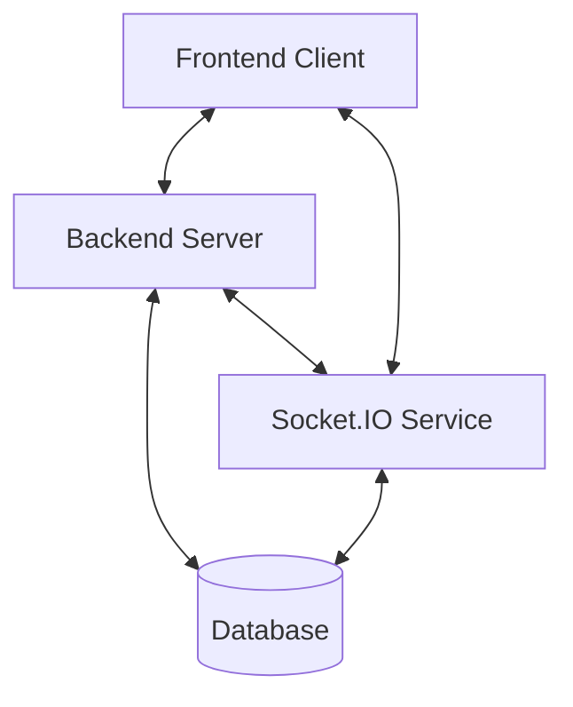
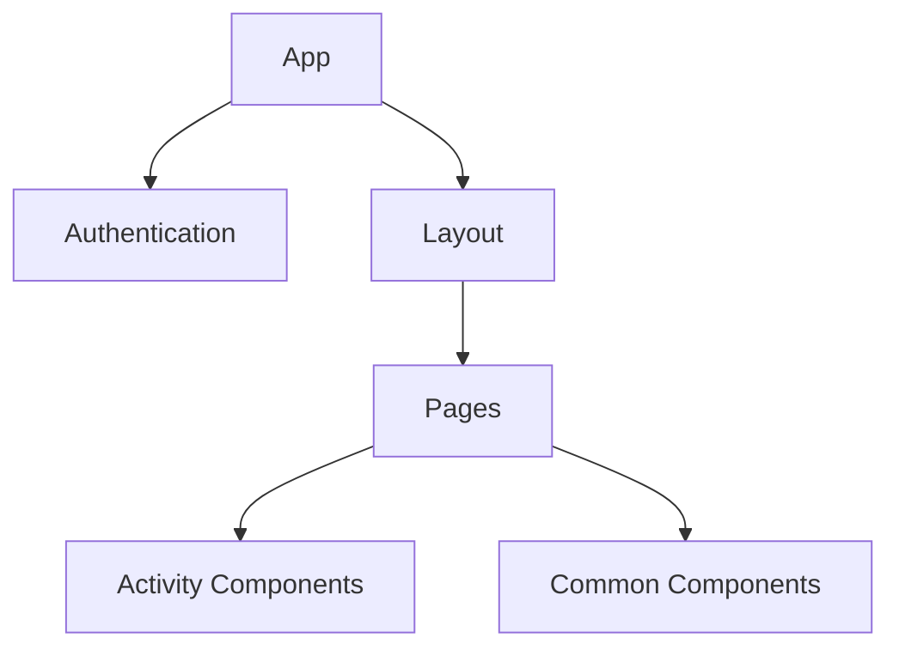

# System Patterns

## System Architecture

LearnConnectLive follows a modern client-server architecture with real-time communication capabilities:



### Key Components

1. **Frontend Client**
   - React.js single-page application
   - Styled Components for UI styling
   - React Router for navigation
   - Context API for state management

2. **Backend Server**
   - Node.js with Express framework
   - RESTful API endpoints
   - Authentication middleware
   - Database access layer

3. **Socket.IO Service**
   - Real-time bidirectional communication
   - Event-based messaging
   - Room-based session management
   - Connection state monitoring

4. **Database**
   - PostgreSQL for relational data storage
   - Firebase/Firestore as alternative or supplementary storage
   - Caching layer for performance optimization

## Key Technical Decisions

### Frontend Framework: React.js
- **Decision**: Use React.js for the frontend application
- **Rationale**: 
  - Component-based architecture matches our UI needs
  - Strong ecosystem and community support
  - Efficient rendering with virtual DOM
  - Flexible state management options

### Real-time Communication: Socket.IO
- **Decision**: Use Socket.IO for real-time functionality
- **Rationale**:
  - Provides reliable WebSocket communication with fallbacks
  - Supports room-based messaging for session management
  - Handles reconnection scenarios automatically
  - Cross-browser compatibility

### Styling Approach: Styled Components
- **Decision**: Use Styled Components for styling
- **Rationale**:
  - Component-scoped styles prevent conflicts
  - Dynamic styling based on props/state
  - Theme support for consistent design language
  - Improved developer experience with CSS-in-JS

### State Management: Context API
- **Decision**: Use React Context API for state management
- **Rationale**:
  - Sufficient for our application's complexity level
  - Avoids additional dependencies like Redux
  - Integrates natively with React's component model
  - Simpler learning curve for developers

### Database Strategy: PostgreSQL with Firebase option
- **Decision**: Support both PostgreSQL and Firebase/Firestore
- **Rationale**:
  - PostgreSQL provides robust relational data capabilities
  - Firebase offers rapid development and real-time features
  - Flexibility for different deployment scenarios
  - Fallback options for reliability

## Design Patterns

### Component Patterns

#### Container/Presentational Pattern
- **Container Components**: Manage data fetching, state, and logic
- **Presentational Components**: Handle rendering and UI concerns
- **Example**: `PresentationView` (container) uses `Poll`, `Quiz`, etc. (presentational)

#### Compound Components
- Used for related UI elements that share state
- Applied in activity components with multiple sub-components
- Example: `Quiz` component with `QuizQuestion`, `QuizOption`, etc.

#### Context Provider Pattern
- Provides state and functionality to component trees
- Used for cross-cutting concerns like notifications, auth
- Example: `NotificationContext`, `AuthContext`

### Architectural Patterns

#### Service Module Pattern
- Encapsulates external communication in service modules
- Centralizes API calls and Socket.IO interactions
- Examples: `apiService.js`, `socketService.js`

#### Event-Driven Architecture
- Components communicate through events rather than direct coupling
- Socket.IO events for real-time updates
- Custom events for cross-component communication

#### Proxy/Adapter Pattern
- Adapts external services to a consistent interface
- Used for abstracting database access (PostgreSQL vs Firebase)
- Provides consistent API regardless of backend implementation

#### Fallback Strategy Pattern
- Implements graceful degradation when primary systems fail
- Example: Socket.IO connection falls back to HTTP polling if WebSockets fail
- Mock data services when API endpoints are unavailable

## Component Relationships

### Frontend Component Hierarchy



### Key Component Relationships

1. **Page-Activity Relationship**
   - Pages (`PresentationView`, `ParticipantView`) render activity components
   - Activities report events back to pages through callbacks
   - Pages manage socket communication and activity state

2. **Context-Component Relationship**
   - Context providers at App level (`NotificationContext`, `AuthContext`)
   - Components consume context through hooks
   - Decouples state management from component implementation

3. **Service-Component Relationship**
   - Components use services for external communication
   - Services abstract API endpoint details
   - Provides separation between UI and data access

## Socket.IO Event Flow

```mermaid
sequenceDiagram
    participant Presenter
    participant Backend
    participant Participant
    
    Presenter->>Backend: create-session
    Backend->>Presenter: session-created (code)
    Participant->>Backend: join-session (code)
    Backend->>Participant: session-info
    Backend->>Presenter: participant-joined
    Presenter->>Backend: update-activity
    Backend->>Participant: activity-started
    Participant->>Backend: activity-response
    Backend->>Presenter: response-received
```

## Error Handling Strategy

1. **Frontend Error Boundaries**
   - React Error Boundaries catch rendering errors
   - Prevent entire application crash on component error
   - Display user-friendly error messages

2. **API Error Handling**
   - Centralized error handling in API service
   - Standardized error response format
   - Automatic retry for transient errors

3. **Socket Connection Error Recovery**
   - Exponential backoff for reconnection attempts
   - Persistent connection monitoring
   - Session state preservation during disconnects

4. **Fallback Content Strategy**
   - Offline mode capabilities
   - Local storage for critical data
   - Graceful degradation of features

## Data Flow Patterns

1. **Unidirectional Data Flow**
   - State flows down through component hierarchy
   - Events flow up through callbacks
   - Follows React's recommended data flow pattern

2. **Publisher-Subscriber**
   - Socket.IO events follow pub/sub pattern
   - Components subscribe to relevant event types
   - Decouples event producers from consumers

3. **Command Pattern**
   - User actions dispatched as commands
   - Commands translated to API calls or socket events
   - Provides clear audit trail of user interactions 

## Enhanced Activity Features

### Poll Visualization Pattern
- **Modular Chart Types**: Each chart type (bar, pie, doughnut, line) is implemented as a separate component with a common interface.
- **Theme Provider**: Color schemes are managed through a theme provider that applies consistent colors across all chart types.
- **Animation Configuration**: Animation settings use a decorator pattern to enhance the base chart with custom animations.
- **Responsive Adaptation**: Charts automatically adjust based on available screen space and device capabilities.

### Quiz Timer Implementation
- **Countdown Component**: Self-contained component that manages its own timer state.
- **Time-based Scoring System**: Implements a scoring strategy pattern that calculates points based on response time.
- **Event-driven Transitions**: Timer completions trigger events that other components can subscribe to.
- **Progressive Feedback**: Visual indicators that change as time progresses (color changes, progress bar).

### Word Cloud Enhancements
- **Shape Constraint System**: Uses a masking approach to constrain word placement to specific shapes.
- **Filter Chain**: Implements a chain of responsibility pattern for word filtering (inappropriate words, filler words, custom filters).
- **Theme Application**: Uses a strategy pattern for applying different color schemes to the word cloud.
- **Layout Algorithm Enhancement**: Extends the base d3-cloud layout algorithm with custom placement rules.